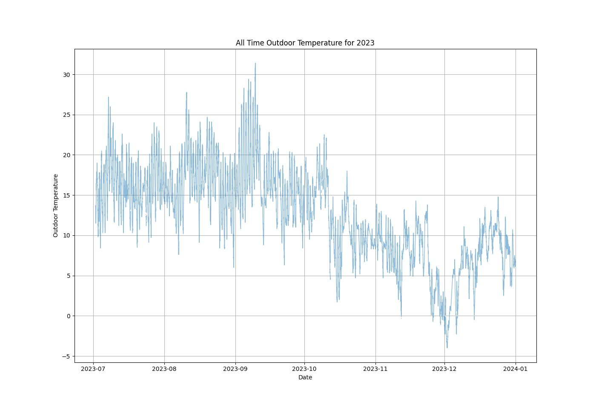

 pyWeatherApp.

The project was written in SQL, this has got a bit complex to my simple mind.
So, rewriting the project in Pandas - it looks simpler.

Scans a given directory for excel spreadsheets the contains daily weather data.
A report can then be generated of the maximum, minimum and mean values for of all time, daily, monthly and yearly.

To install dependencies pip -r requirements.txt

For changes see history.txt

```
┌─────────────────────────────────── pyWeather 2025.26 ───────────────────────────────────┐
│ This program comes with ABSOLUTELY NO WARRANTY; for details type `pyWeather -l'.        │
│ This is free software, and you are welcome to redistribute it under certain conditions. │
└──────────────────────────── Copyright (C) 2025  Kevin Scott ────────────────────────────┘

usage: main.py [-h] [-l] [-v] [-e] [-i] [-c] [-cD] [-b] [-D] [-M] [-T] [-Y] [-A] [-P PLOT] [-H] [-y YEAR] [-m MONTH] [-d DAY] [-Z]

Builds a main data store out of individual weather data spreadsheets.

options:
  -h, --help          show this help message and exit
  -l, --license       Print the Software License.
  -v, --version       Print the version of the application.
  -e, --explorer      Load program working directory into file explorer.
  -i, --info          Print info on the data store [Pandas dataFrame].
  -c, --check         Check data store integrity.
  -cD, --checkDelete  Check data store integrity and delete unwanted.
  -b, --build         Build the data data store - consolidate the spreadsheets.
  -D, --Dreport       Report on the data data store - finds the Daily highs and lows, for a given year, month and day.
  -M, --Mreport       Report on the data data store - finds the monthly highs and lows, for a given month and year.
  -T, --Treport       Report on the data data store - finds the monthly highs and lows, for a given month across all years.
  -Y, --Yreport       Report on the data data store - finds the yearly highs and lows, for a given year.
  -A, --Areport       Report on the data data store - finds the all time highs and lows.
  -P, --Plot PLOT     Plot a line graph of the table, -H for column selection.
  -H, --PlotHelp      Display the column selection for plotting.
  -y, --year YEAR     Year of data files to report on.
  -m, --month MONTH   Month of data files to report on.
  -d, --day DAY       Day of data files to report on.
  -Z, --Zap           Delete [Zap] both data and file stores.

 Kevin Scott (C) 2025 :: pyWeather V2025.28
```


