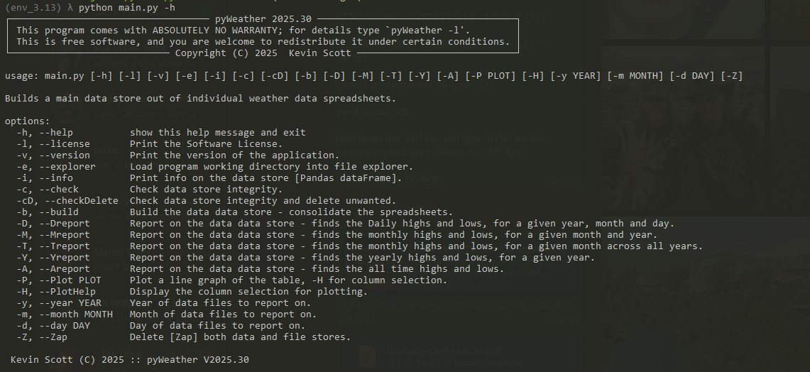

 pyWeatherApp.

The project was written in SQL, this has got a bit complex to my simple mind.
So, rewriting the project in Pandas - it looks simpler.

Scans a given directory for excel spreadsheets the contains daily weather data.
A report can then be generated of the maximum, minimum and mean values for of all time, daily, monthly and yearly.

To install dependencies pip -r requirements.txt

For changes see history.txt

!

